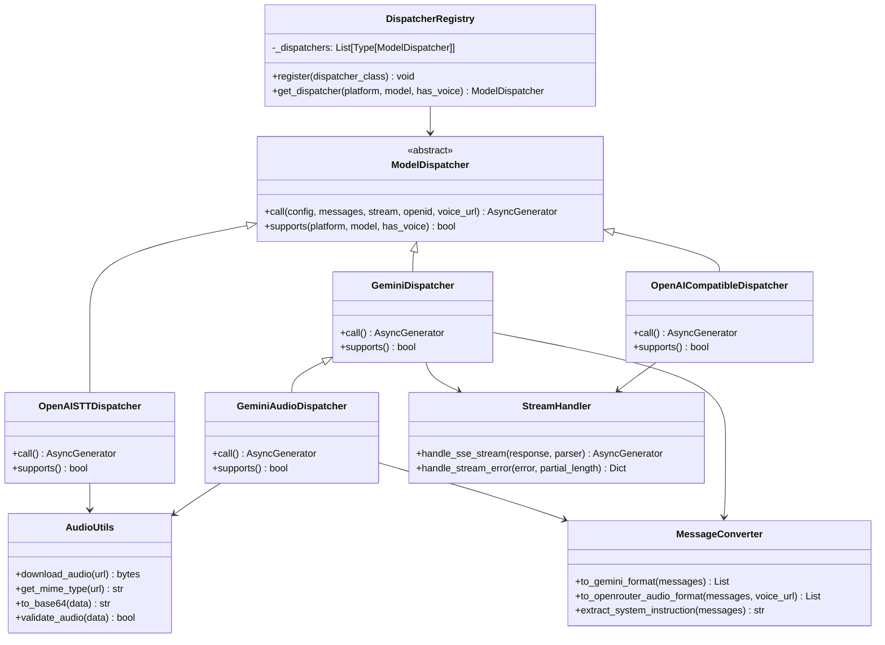

# Design Document: Model Dispatcher Refactor

## Overview

本设计将 `model_dispatchers.py`（1270 行）重构为模块化的 `dispatchers/` 包，采用注册表模式实现分发器的动态注册和选择。通过提取公共工具类和抽象基类，减少代码重复，提高可维护性和可扩展性。

## Architecture

### 目录结构

```
cloudrun-fastapi/app/services/
├── dispatchers/                    # 分发器包
│   ├── __init__.py                 # 导出公共接口，保持向后兼容
│   ├── base.py                     # 基类和注册表
│   ├── openai_compatible.py        # OpenAI 兼容分发器
│   ├── gemini.py                   # Gemini 分发器
│   ├── gemini_audio.py             # Gemini 音频分发器
│   ├── openai_stt.py               # OpenAI STT 分发器
│   └── utils/                      # 工具模块
│       ├── __init__.py
│       ├── stream_handler.py       # 流式响应处理
│       ├── audio_utils.py          # 音频处理工具
│       └── message_converter.py    # 消息格式转换
├── model_dispatchers.py            # 保留，重新导出以保持兼容性
└── ...
```

### 架构图



## Components and Interfaces

### 1. ModelDispatcher 基类 (base.py)

```python
from abc import ABC, abstractmethod
from typing import Dict, Any, List, AsyncGenerator, Optional

class ModelDispatcher(ABC):
    """模型调用分发器基类"""
    
    @abstractmethod
    async def call(
        self,
        config: Dict[str, Any],
        messages: List[Dict],
        stream: bool,
        openid: Optional[str] = None,
        voice_url: Optional[str] = None,
    ) -> AsyncGenerator[Dict[str, Any], None]:
        """调用模型 API"""
        pass
    
    @classmethod
    @abstractmethod
    def supports(cls, platform: str, model: str, has_voice: bool = False) -> bool:
        """判断是否支持指定的平台和模型"""
        pass
    
    @classmethod
    def priority(cls) -> int:
        """分发器优先级，数值越大优先级越高"""
        return 0
```

### 2. DispatcherRegistry 注册表 (base.py)

```python
class DispatcherRegistry:
    """分发器注册表"""
    
    _dispatchers: List[type] = []
    
    @classmethod
    def register(cls, dispatcher_class: type) -> type:
        """注册分发器（可用作装饰器）"""
        cls._dispatchers.append(dispatcher_class)
        # 按优先级排序
        cls._dispatchers.sort(key=lambda d: d.priority(), reverse=True)
        return dispatcher_class
    
    @classmethod
    def get_dispatcher(
        cls,
        platform: str,
        model: str,
        has_voice: bool = False
    ) -> ModelDispatcher:
        """获取匹配的分发器实例"""
        for dispatcher_class in cls._dispatchers:
            if dispatcher_class.supports(platform, model, has_voice):
                return dispatcher_class()
        raise ValueError(f"No dispatcher found for {platform}/{model}")
```

### 3. StreamHandler 流式处理器 (utils/stream_handler.py)

```python
from typing import Dict, Any, AsyncGenerator, Callable
import httpx

class StreamHandler:
    """SSE 流式响应处理器"""
    
    @staticmethod
    async def handle_openai_stream(
        response: httpx.Response,
        openid: Optional[str] = None,
    ) -> AsyncGenerator[Dict[str, Any], None]:
        """处理 OpenAI 格式的 SSE 流"""
        partial_content_length = 0
        
        try:
            async for line in response.aiter_lines():
                if line.startswith("data: "):
                    data_str = line[6:]
                    if data_str == "[DONE]":
                        yield {"type": "done"}
                        break
                    # 解析并 yield 内容...
        except Exception as e:
            yield StreamHandler.handle_stream_error(e, partial_content_length)
    
    @staticmethod
    def handle_stream_error(
        error: Exception,
        partial_content_length: int
    ) -> Dict[str, Any]:
        """处理流式错误，返回中断事件"""
        if partial_content_length > 0:
            return {
                "type": "stream_interrupted",
                "message": f"响应异常: {type(error).__name__}",
                "partial_content_length": partial_content_length,
            }
        raise error
```

### 4. AudioUtils 音频工具 (utils/audio_utils.py)

```python
from typing import Tuple, Optional
import httpx

class AudioUtils:
    """音频处理工具类"""
    
    MIME_TYPE_MAP = {
        ".mp3": "audio/mp3",
        ".wav": "audio/wav",
        ".m4a": "audio/m4a",
        ".aac": "audio/aac",
        ".ogg": "audio/ogg",
        ".flac": "audio/flac",
    }
    
    AUDIO_SIGNATURES = {
        b'ID3': "audio/mp3",
        b'\xff\xfb': "audio/mp3",
        b'\xff\xfa': "audio/mp3",
        b'RIFF': "audio/wav",
        b'fLaC': "audio/flac",
        b'OggS': "audio/ogg",
    }
    
    @classmethod
    async def download_audio(
        cls,
        url: str,
        timeout: float = 30.0
    ) -> Tuple[bytes, str]:
        """下载音频文件，返回 (数据, MIME类型)"""
        async with httpx.AsyncClient(timeout=timeout) as client:
            response = await client.get(url, follow_redirects=True)
            response.raise_for_status()
            data = response.content
            mime_type = cls.get_mime_type(url, data)
            return data, mime_type
    
    @classmethod
    def get_mime_type(
        cls,
        url: str,
        data: Optional[bytes] = None
    ) -> str:
        """推断音频 MIME 类型"""
        # 先从 URL 推断
        url_lower = url.lower()
        for ext, mime in cls.MIME_TYPE_MAP.items():
            if ext in url_lower:
                return mime
        
        # 从文件头推断
        if data:
            for sig, mime in cls.AUDIO_SIGNATURES.items():
                if data.startswith(sig):
                    return mime
        
        return "audio/mp3"  # 默认
    
    @classmethod
    def to_base64(cls, data: bytes) -> str:
        """转换为 base64 字符串"""
        import base64
        return base64.b64encode(data).decode('utf-8')
    
    @classmethod
    def validate_audio(cls, data: bytes) -> bool:
        """验证音频数据有效性"""
        if len(data) < 1000:
            return False
        for sig in cls.AUDIO_SIGNATURES:
            if data.startswith(sig):
                return True
        return False
```

### 5. MessageConverter 消息转换器 (utils/message_converter.py)

```python
from typing import Dict, List, Tuple, Optional

class MessageConverter:
    """消息格式转换器"""
    
    @classmethod
    def to_gemini_format(cls, messages: List[Dict]) -> Tuple[List[Dict], Optional[str]]:
        """
        将 OpenAI 格式消息转换为 Gemini 格式
        
        Returns:
            (contents, system_instruction)
        """
        contents = []
        system_instruction = None
        
        for msg in messages:
            role = msg.get("role", "user")
            content = msg.get("content", "")
            
            if role == "system":
                system_instruction = content
                continue
            
            gemini_role = "user" if role == "user" else "model"
            parts = cls._convert_content_to_parts(content)
            
            contents.append({
                "role": gemini_role,
                "parts": parts,
            })
        
        return contents, system_instruction
    
    @classmethod
    def _convert_content_to_parts(cls, content) -> List[Dict]:
        """将内容转换为 Gemini parts 格式"""
        if isinstance(content, str):
            return [{"text": content}]
        elif isinstance(content, list):
            parts = []
            for item in content:
                if item.get("type") == "text":
                    parts.append({"text": item.get("text", "")})
                elif item.get("type") == "image_url":
                    parts.append(cls._convert_image_item(item))
            return parts
        return [{"text": str(content)}]
    
    @classmethod
    def to_openrouter_audio_format(
        cls,
        messages: List[Dict],
        voice_url: str
    ) -> List[Dict]:
        """构建 OpenRouter 音频格式消息"""
        result = []
        user_text = ""
        
        for msg in messages:
            role = msg.get("role", "user")
            content = msg.get("content", "")
            
            if role == "system":
                result.append({"role": "system", "content": content})
            elif role == "user":
                user_text = cls._extract_text(content)
            else:
                result.append({"role": role, "content": content})
        
        # 构建包含音频的用户消息
        user_content = [
            {"type": "text", "text": user_text or "请听取并回复这段语音内容"},
            {"type": "input_audio", "input_audio": {"url": voice_url}}
        ]
        result.append({"role": "user", "content": user_content})
        
        return result
```

## Data Models

### 响应事件类型

```python
from typing import TypedDict, Literal, Optional

class TextEvent(TypedDict):
    type: Literal["text"]
    content: str

class DoneEvent(TypedDict):
    type: Literal["done"]

class StreamInterruptedEvent(TypedDict):
    type: Literal["stream_interrupted"]
    message: str
    partial_content_length: int

class TranscriptionEvent(TypedDict):
    type: Literal["transcription"]
    text: str

class ErrorEvent(TypedDict):
    type: Literal["error"]
    error: str

ResponseEvent = TextEvent | DoneEvent | StreamInterruptedEvent | TranscriptionEvent | ErrorEvent
```


## Correctness Properties

*A property is a characteristic or behavior that should hold true across all valid executions of a system—essentially, a formal statement about what the system should do. Properties serve as the bridge between human-readable specifications and machine-verifiable correctness guarantees.*

Based on the prework analysis, the following correctness properties have been identified:

### Property 1: Registry Registration and Selection

*For any* dispatcher class that is registered with the registry, calling `get_dispatcher()` with matching platform/model/has_voice parameters SHALL return an instance of that dispatcher class. When multiple dispatchers match, the one with highest priority SHALL be selected.

**Validates: Requirements 2.1, 2.2, 2.3, 2.4**

### Property 2: Stream Error Handling with Partial Recovery

*For any* stream processing that encounters an error (timeout, connection error, etc.) after receiving partial content, the StreamHandler SHALL yield a `stream_interrupted` event containing the correct `partial_content_length` value equal to the sum of all content received before the error.

**Validates: Requirements 3.2, 3.3, 3.4**

### Property 3: SSE Format Parsing

*For any* valid SSE stream in either OpenAI format (`data: {"choices":[{"delta":{"content":"..."}}]}`) or Gemini format (`data: {"candidates":[{"content":{"parts":[{"text":"..."}]}}]}`), the StreamHandler SHALL correctly extract and yield all text content.

**Validates: Requirements 3.5**

### Property 4: Audio MIME Type Inference

*For any* URL containing a known audio extension (.mp3, .wav, .m4a, .aac, .ogg, .flac) or audio data with a valid file signature, `AudioUtils.get_mime_type()` SHALL return the correct MIME type string.

**Validates: Requirements 4.2**

### Property 5: Audio Validation

*For any* byte sequence, `AudioUtils.validate_audio()` SHALL return `True` if and only if the data is at least 1000 bytes and starts with a recognized audio file signature (ID3, 0xFFFA, 0xFFFB, RIFF, fLaC, OggS).

**Validates: Requirements 4.4**

### Property 6: Base64 Round-Trip

*For any* byte sequence, encoding with `AudioUtils.to_base64()` and then decoding with base64.b64decode() SHALL produce the original byte sequence.

**Validates: Requirements 4.3**

### Property 7: Multimodal Message Conversion

*For any* OpenAI format message list containing text, images, and/or audio content, `MessageConverter.to_gemini_format()` SHALL produce a Gemini format message list that preserves all content items with correct types (text → text parts, image_url → inline_data/file_data, audio → file_data).

**Validates: Requirements 5.1, 5.2, 5.3**

### Property 8: System Instruction Extraction

*For any* message list containing a message with role "system", `MessageConverter.extract_system_instruction()` SHALL return the content of that system message. For message lists without a system message, it SHALL return None.

**Validates: Requirements 5.4**

### Property 9: Backward Compatibility

*For any* import statement that worked with the original `model_dispatchers.py` (e.g., `from app.services.model_dispatchers import ModelDispatcher, OpenAICompatibleDispatcher`), the same import SHALL continue to work after refactoring.

**Validates: Requirements 1.4**

## Error Handling

### HTTP Errors

| Error Type | Handling Strategy |
|------------|-------------------|
| 4xx Client Errors | Log error details, raise `ValueError` with status code |
| 5xx Server Errors | Log error, retry once with exponential backoff, then raise |
| Timeout | If partial content received, yield `stream_interrupted`; otherwise raise |
| Connection Error | Log error, yield `stream_interrupted` if partial content |

### Audio Processing Errors

| Error Type | Handling Strategy |
|------------|-------------------|
| Download Failed | Return descriptive error message with HTTP status |
| Invalid Format | Log warning, attempt processing anyway |
| File Too Small | Raise `ValueError` with size information |

### Message Conversion Errors

| Error Type | Handling Strategy |
|------------|-------------------|
| Unknown Content Type | Convert to string representation |
| Missing Required Fields | Use default values where possible |
| Invalid Data URL | Return original URL, log warning |

## Testing Strategy

### Unit Tests

Unit tests will verify specific examples and edge cases:

1. **Directory Structure Tests**: Verify expected files exist after refactoring
2. **Import Compatibility Tests**: Verify old import paths still work
3. **API Contract Tests**: Verify interfaces match expected signatures

### Property-Based Tests

Property-based tests will use `hypothesis` library to verify universal properties:

```python
# Example test structure
from hypothesis import given, strategies as st

@given(st.binary(min_size=1000))
def test_base64_round_trip(data: bytes):
    """Property 6: Base64 encoding round-trip"""
    encoded = AudioUtils.to_base64(data)
    decoded = base64.b64decode(encoded)
    assert decoded == data
```

**Test Configuration**:
- Minimum 100 iterations per property test
- Each test tagged with: `Feature: model-dispatcher-refactor, Property N: <description>`

### Test File Organization

```
cloudrun-fastapi/tests/services/dispatchers/
├── test_registry.py           # Property 1, 9
├── test_stream_handler.py     # Property 2, 3
├── test_audio_utils.py        # Property 4, 5, 6
├── test_message_converter.py  # Property 7, 8
└── conftest.py                # Shared fixtures
```

## Migration Plan

### Phase 1: Create New Structure (Non-Breaking)

1. Create `dispatchers/` package with new modules
2. Implement all classes in new locations
3. Keep original `model_dispatchers.py` unchanged

### Phase 2: Add Re-exports

1. Update `dispatchers/__init__.py` to export all public classes
2. Update original `model_dispatchers.py` to re-export from new package
3. Verify all existing imports still work

### Phase 3: Update Internal References

1. Update internal code to use new import paths
2. Add deprecation warnings to old import paths (optional)
3. Update documentation

### Phase 4: Cleanup (Future)

1. Remove deprecated re-exports after transition period
2. Delete original `model_dispatchers.py` (or keep as thin re-export layer)

