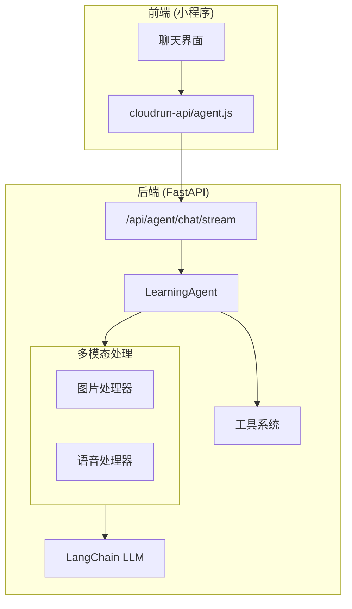
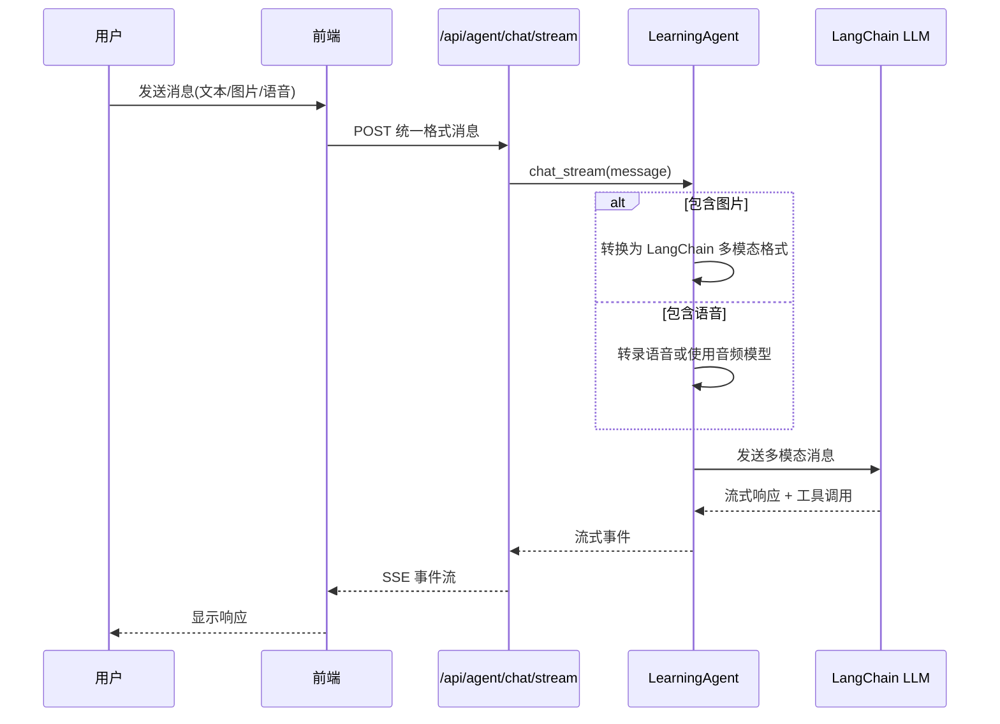

# Design Document: 多模态 Agent 统一

## Overview

本设计将所有消息类型（文本、图片、语音）统一通过 LangChain Agent 处理，实现工具调用能力的全面支持。核心改动是扩展 `LearningAgent` 支持多模态输入，并简化 API 接口。

### 设计目标
1. **统一入口**：所有消息通过 `/api/agent/chat/stream` 处理
2. **多模态支持**：Agent 能理解图片和语音内容
3. **工具调用**：图片/语音消息也能触发工具调用
4. **代码简化**：移除冗余的 `ModelRouter` 和 `chat_multimodal` 模块

## Architecture



### 消息流程



## Components and Interfaces

### 1. API 层修改

#### AgentChatRequest 扩展

```python
class MultimodalMessage(BaseModel):
    """多模态消息内容"""
    text: Optional[str] = None           # 文本内容
    image_url: Optional[str] = None      # 图片 URL
    image_base64: Optional[str] = None   # 图片 Base64
    voice_url: Optional[str] = None      # 语音文件 URL
    voice_text: Optional[str] = None     # 语音转文本结果（可选）


class AgentChatRequest(BaseModel):
    """Agent 对话请求（扩展多模态支持）"""
    # 兼容旧版纯文本
    message: Optional[str] = None
    # 新版多模态消息
    multimodal: Optional[MultimodalMessage] = None
    mode: str = "coach"
    context: Optional[dict] = None
```

#### 接口行为
- 如果 `message` 有值，按纯文本处理（向后兼容）
- 如果 `multimodal` 有值，按多模态处理
- 两者都有时，`multimodal` 优先

### 2. LearningAgent 多模态支持

#### 核心修改：chat_stream 方法

```python
async def chat_stream(
    self,
    message: str = None,
    multimodal: Optional[Dict[str, Any]] = None,
    context: Optional[Dict[str, Any]] = None,
) -> AsyncIterator[Dict[str, Any]]:
    """
    与 Agent 对话（流式）- 支持多模态
    
    Args:
        message: 纯文本消息（向后兼容）
        multimodal: 多模态消息 {text, image_url, image_base64, voice_url, voice_text}
        context: 额外上下文
    """
    # 构建 LangChain 消息
    if multimodal:
        content = self._build_multimodal_content(multimodal)
    else:
        content = message
    
    messages = [HumanMessage(content=content)]
    # ... 其余流式处理逻辑
```

#### 多模态内容构建

```python
def _build_multimodal_content(self, multimodal: Dict[str, Any]) -> List[Dict]:
    """
    构建 LangChain 多模态消息内容
    
    LangChain 多模态格式：
    [
        {"type": "text", "text": "..."},
        {"type": "image_url", "image_url": {"url": "..."}},
    ]
    """
    content = []
    
    # 文本部分
    text = multimodal.get("text", "")
    if text:
        content.append({"type": "text", "text": text})
    
    # 图片部分
    image_url = multimodal.get("image_url")
    image_base64 = multimodal.get("image_base64")
    if image_url:
        content.append({
            "type": "image_url",
            "image_url": {"url": image_url}
        })
    elif image_base64:
        content.append({
            "type": "image_url",
            "image_url": {"url": f"data:image/jpeg;base64,{image_base64}"}
        })
    
    # 语音部分（转文本后作为文本处理）
    voice_text = multimodal.get("voice_text")
    if voice_text and not text:
        content.append({"type": "text", "text": voice_text})
    
    # 如果只有语音 URL，需要先转录
    voice_url = multimodal.get("voice_url")
    if voice_url and not voice_text:
        # 异步转录语音
        transcribed = await self._transcribe_voice(voice_url)
        content.append({"type": "text", "text": transcribed})
    
    return content if len(content) > 1 else content[0]["text"] if content else ""
```

### 3. 语音处理策略

```python
async def _transcribe_voice(self, voice_url: str) -> str:
    """
    转录语音为文本
    
    策略：
    1. 优先使用 OpenAI Whisper API
    2. 降级到其他 ASR 服务
    """
    from ..services.dispatchers import OpenAISTTDispatcher
    
    dispatcher = OpenAISTTDispatcher()
    result = await dispatcher.transcribe(voice_url)
    return result.get("text", "")
```

### 4. 前端适配

#### 新增 agent.js 模块

```javascript
/**
 * Agent 对话（流式）- 支持多模态
 * 
 * @param {Object} params
 * @param {String} params.message 纯文本消息（向后兼容）
 * @param {Object} params.multimodal 多模态消息
 * @param {String} params.multimodal.text 文本内容
 * @param {String} params.multimodal.imageUrl 图片 URL
 * @param {String} params.multimodal.imageBase64 图片 Base64
 * @param {String} params.multimodal.voiceUrl 语音 URL
 * @param {String} params.multimodal.voiceText 语音转文本
 * @param {String} params.mode Agent 模式
 * @param {Object} params.context 上下文
 */
function agentChatStream(params, onEvent, onComplete, onError) {
  const data = {
    mode: params.mode || 'coach',
    context: params.context || null,
  };
  
  // 兼容纯文本和多模态
  if (params.multimodal) {
    data.multimodal = {
      text: params.multimodal.text || null,
      image_url: params.multimodal.imageUrl || null,
      image_base64: params.multimodal.imageBase64 || null,
      voice_url: params.multimodal.voiceUrl || null,
      voice_text: params.multimodal.voiceText || null,
    };
  } else {
    data.message = params.message;
  }
  
  return streamRequestWithEvents(
    { url: '/api/agent/chat/stream', data },
    onEvent,
    onComplete,
    onError
  );
}
```

## Data Models

### 请求模型

```python
class MultimodalMessage(BaseModel):
    """多模态消息"""
    text: Optional[str] = Field(default=None, description="文本内容")
    image_url: Optional[str] = Field(default=None, description="图片URL")
    image_base64: Optional[str] = Field(default=None, description="图片Base64")
    voice_url: Optional[str] = Field(default=None, description="语音URL")
    voice_text: Optional[str] = Field(default=None, description="语音转文本")


class AgentChatRequest(BaseModel):
    """Agent 对话请求"""
    message: Optional[str] = Field(default=None, description="纯文本消息")
    multimodal: Optional[MultimodalMessage] = Field(default=None, description="多模态消息")
    mode: str = Field(default="coach", description="Agent模式")
    context: Optional[dict] = Field(default=None, description="上下文")
```

### 响应事件

```python
# SSE 事件类型
{
    "type": "text",           # 文本内容
    "content": "..."
}

{
    "type": "tool_start",     # 工具调用开始
    "tool_name": "...",
    "display_name": "...",
    "icon": "...",
    "tool_input": {...}
}

{
    "type": "tool_end",       # 工具调用结束
    "tool_name": "...",
    "tool_output": {...},
    "success": true
}

{
    "type": "transcription",  # 语音转文本结果（新增）
    "text": "..."
}
```

## Correctness Properties

*A property is a characteristic or behavior that should hold true across all valid executions of a system-essentially, a formal statement about what the system should do. Properties serve as the bridge between human-readable specifications and machine-verifiable correctness guarantees.*

### Property 1: 消息格式验证
*For any* AgentChatRequest，如果包含 `multimodal` 字段，则 `multimodal` 中至少有一个非空字段（text/image_url/image_base64/voice_url/voice_text）。
**Validates: Requirements 2.1, 2.2**

### Property 2: 多模态内容转换
*For any* 包含图片的多模态消息，`_build_multimodal_content` 方法应返回包含 `image_url` 类型元素的列表。
**Validates: Requirements 2.3**

### Property 3: 向后兼容
*For any* 只包含 `message` 字段的请求，Agent 应按纯文本处理，行为与修改前一致。
**Validates: Requirements 1.1**

### Property 4: 语音转文本
*For any* 包含 `voice_url` 但不包含 `voice_text` 的消息，Agent 应先转录语音再处理。
**Validates: Requirements 2.4**

## Error Handling

### 1. 图片处理错误
- 图片 URL 无效：返回错误提示，建议重新上传
- 图片格式不支持：返回支持的格式列表
- 图片过大：返回大小限制提示

### 2. 语音处理错误
- 语音 URL 无效：返回错误提示
- 转录失败：降级到提示用户手动输入
- 语音过长：返回时长限制提示

### 3. 模型不支持多模态
- 检测模型能力，不支持时降级到文本描述
- 记录日志，便于后续优化

## Testing Strategy

### 单元测试
1. `_build_multimodal_content` 方法测试
   - 纯文本输入
   - 图片 URL 输入
   - 图片 Base64 输入
   - 语音转文本输入
   - 组合输入

2. 请求模型验证测试
   - 空消息拒绝
   - 有效消息接受

### 属性测试
1. **消息格式验证属性**：生成随机 MultimodalMessage，验证至少有一个非空字段
2. **多模态转换属性**：生成包含图片的消息，验证转换结果格式正确
3. **向后兼容属性**：生成纯文本请求，验证处理结果与旧版一致

### 集成测试
1. 端到端测试：发送多模态消息，验证完整流程
2. 工具调用测试：发送图片消息，验证能触发工具调用
3. 降级测试：模拟模型不可用，验证降级逻辑

## 代码清理计划

### 删除文件
- `cloudrun-fastapi/app/routers/chat_multimodal.py`
- `cloudrun-fastapi/app/services/model_router.py`

### 保留文件
- `cloudrun-fastapi/app/services/model_dispatchers.py` - Agent 内部可能复用
- `cloudrun-fastapi/app/services/dispatchers/` - 分发器模块保留

### 前端清理
- 移除 `chat.js` 中的 `chatMultimodal` 和 `chatMultimodalStream`
- 新增 `agent.js` 中的 `agentChatStream` 多模态支持
